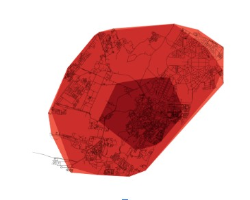

# Isochrones-

The project builds a tkinter based GUI application for projecting static isochrones over the map. The user can select different time bins, city location etc to configure the static isochrones displayed
Technologies used are python, tkinter, osmnx, geopandas

Area based isochrones generated using the application with time bins

Tkinter Application

Link/Edge based isochrones
